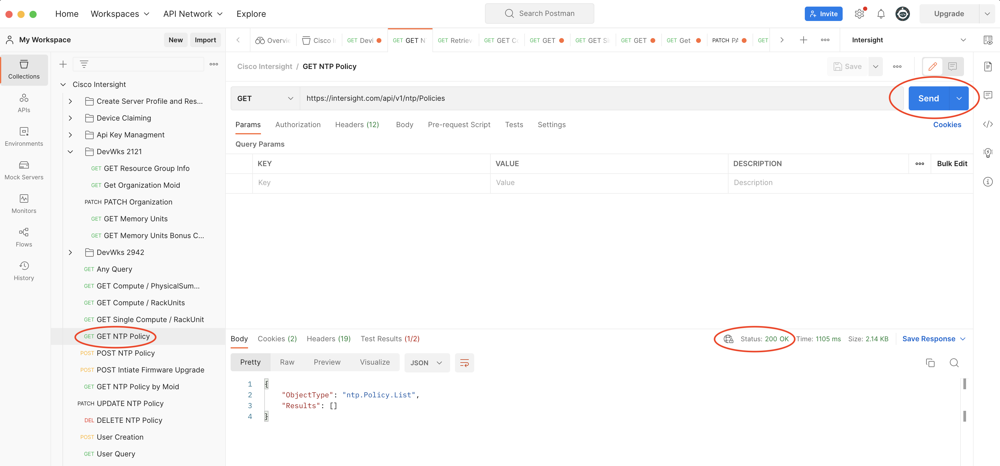

**You made it to Amsterdam and DEVWKS-2942!** 

This lab will walk you through
the basics of interacting with the Intersight API for IMM objects as
well as using Terraform to create and manage those objects.


Let's start by logging into Intersight and seeing what's available.

**Scenario 1 -- Intersight organization and the API Browser**

Open a browser and go to <https://intersight.com> you can log in with the credentials on the super fancy papers handed out before the lab.

Open another tab and go to <https://intersight.com/apidocs> You will
notice that when you open the "apidocs" page your lab username will show
in the top right corner:


The "Guides" tab has useful information for weird people that like to
RTFM, but you are running a lab and nobody got time for that.

The "Downloads" tab shows all of the ways you can interact with
Intersight. In this lab we will use the native API Browser, Postman, and
some Terraform. Feel free to check out the other methods and resources
when you have some spare time.

Go to the "API Reference" tab to access the native Intersight API
browser:


All of the available API calls are on the left side of the browser.

In this lab we going to get familiar with the Intersight API specific to
IMM policies. We will start with Domain Profiles.

You can head on over to the Intersight Help Center to read more:
<https://intersight.com/help/saas/features/servers/operate#domain_profiles>

Again reading docs is hard, here is a pretty picture:


Lets start by looking at an example of a Domain Profile. Go to your
Intersight tab, select "Infrastructure Service" from the drop down, hit Profiles on the left, select the "UCS Domain Profiles" tab, and you will see the
"API-Test" profile listed:


Feel free to click on the profile and look through the sub-policies that
make up the profile.

Now lets find this sucker in the API! On the API browser tab, go to the
search box on the left and type:

"domain"


You will notice that the options whittle down as you type.

Select the iam/DomainGroups item and click the "GET Read a iam.Domain
Group resource" call. You will notice that the browser now shows up on
the right hand side. When you click send JSON output from the GET call
will populate in the Response Text box. This is live data from the
Intersight portal that you are logged into:


Look through the JSON response text and see if anything looks like it
matches our "API-Test" policy....


First lesson with the Intersight API is that things don't always make
sense. Lets redo our search by typing:

```fabric/Switch```

Expand "fabric/SwitchClusterProfiles" and select the top GET call. Hit
"Send" and take a look at the response. You should see the name
"API-Test" on line 22. Looks like we got the right call!


You will now see a JSON output of all the items associated with "Domain
Profiles" and their associated properties. There is a lot of information
here and we want to narrow it down to the things that will help us to
make sense of the environment.

In the API browser we can see the parameters that we can apply to the
GET call to change the JSON output. Let's start by only grabbing the
fields we want to see using the \$select query.

On the right side of the API browser hit the "+ Query Paramater" and add:

Key 

```$select```

Value

```Name,Description,SwitchProfiles```

then
hit "Send" to see the results:


It looks like the API gave us exactly what we asked for with a little
extra. You can see the "Name", "Description" and "SwitchProfiles"
fields. Also notice that there are "Moid" fields in several places. Just
about every object in Intersight has a Moid. You usually need the "Moid"
when you are performing a POST, PATCH, or DELETE.

Another thing to notice is that the "SwitchProfile" output indents a
level and includes a "link" along with the cryptic Moid value. This
means that the switch profile is another managed object in the API:
<https://intersight.com/apidocs/introduction/mit/#supported-types-in-the-object-model-schema>

We can refine our query more to include responses from the switch
profile. Add another Query Parameter of:

Key

```$expand```

Value

```SwitchProfiles```

then hit "Send"


Now you will notice that under the "SwitchProfiles" indent we see quite
a few more fields relating to the switch profiles.

We can even refine this output more by adding to the \$expand key.
Change to:

Key

```$expand``` 

Value

```SwitchProfiles($select=Name,Description)```

and hit "Send" to see how the output changes:


Feeling pretty good with your API Skills? Lets start building some new
profiles/policies

Things are getting a little hairy for the API Browser, so lets move over
to Postman!


Open Postman and there should be an Intersight Collection on the left
and an environment for Intersight on the right. Make sure both are
selected.


For this lab I have already created an API key and configured it in the environment.  To see the key go back to the main Intersight.com site, ensure that the dropdown shows "System", select "Settings" on the left, scroll down and select to "API Keys" on the menu.


You should see the already generated "LabGod" key.  The API Key ID is visable but the secret-key is only available when generating a new key.   


We can see the key by going back to Postman, click the
"environment quick look" icon to the right of the Intersight environment:


Hit "Edit" in the top right to see the api-key-id and secret-key:


We can test the Postman config by selecting the "GET NTP Policy", and
hopefully getting a "200 OK" response




**Scenario 2 -- Create a VLAN and assign to an Ethernet Policy**


Now that we have Postman up and running lets start by looking at an
existing VLAN config for inspiration.

In Postman, click on the "GET Any Query" object on the left. We can use
this as a template to create any API call to Intersight. Go back to the
Intersight API browser and search for VLAN:


Once you select the "GET Read a 'fabric.Vlan' resource call, the API URL
populates on the right side of the client. Copy that and add it to the
GET box in Postman.  Make sure you have the full URL:

```https://intersight.com/api/v1/fabric/Vlans```


Hit the "Send" button and you should see results in the body:


Notice this is still saved as the "Any Query", we can now create a new
Postman object by clicking the dropdown next to the "Save" button,
select "Save As":


Change the Request Name to "Get VLANs" and save in the
DevWks2942 folder:


Looking through the results you can see that there are several VLANs
listed. We can filter this down by only displaying one VLAN. To do this
add

Key

```$filter```

Value

```VlanId eq 500```

This will only display the response for anything with VlanId as 500. Hit
send to see the new results. There should only 57 lines in the body. We
can also see that there is a "Parent" value that reference items outside
of the VLANs:


We need to expand this to see more details about the EthNetworkPolicy
that our VLAN belongs to.

Add another Key:

Key

```$expand```

Value

```Parent```


Hit send to get the results. Now we can see that the Parent has a name
of "API-VLAN", line 47


And we can see that the "API-VLAN" object is assigned to two different
Profiles starting on line 66:


This is starting to look familiar, remember our model:


We can get tricky and Expand a value within an existing \$expand.

Get your Inception tops out, things are going to get weird


On your \$expand key we are going to nest another expansion along with a
\$select statement to only show the fields we want to see. Change the
value in your existing \$expand to this:

Value

```Parent($select=Name,Profiles%3B$expand=Profiles($select=Name))```


Now when we hit send we will see a full picture of a VLAN object:


VLAN 500 belongs to "API-VLAN" EthNetworkPolicy, which is in turn
applied to "API-Test-A" and "API-Test-B" SwitchProfile(s).

We are finally here, the moment where we add a VLAN to your
EthNetworkPolicy!


First lets look at the EthNetworkPolicy in the GUI. On the Intersight
tab, click "Policies", then click on the "API-VLAN" policy and look at
the Configuration in the right pane:


You can see on the configuration that VLAN 200-500 have been created.

Go back to Postman, on the left panel workspace expand the DevWks 2942
folder and click the "POST Create a 'fabric.Vlan' resource" call:


**IMPORTANT**

In the body be sure to change the Name and VlanId to match your Pod
number! If I was Pod 7 I would use "Denver-Prod_107" and "VlanId": 107

Hit Send and you should get a response with the new VLAN info.

Go back to the Intersight GUI and take a look at the API-VLAN policy to
see your addition:


Congratulations you just did something with the Intersight API!


**Scenario 3 -- Going 0-60 in .5sec with Terraform**

The API browser and Postman are great for grabbing information and
making small changes. When it comes to managing a real IMM environment
you need something with a little more punch and Terraform is a great way
to do that.


Open Visual Studio Code and if the folder is not already open, hit
"File", "Open Folder" and navigate to "devwks2942" and hit
"Open"


On the left click "main.tf" and you should see a screen that looks
something like this:


The "main.tf" file already has some information loaded. At the very top,
line 1-8, you will see the call to the 1.0.28 version of the Intersight
Terraform provider:


After that in lines 10-15, I have hard coded environment variables
including an API key and secret file. **DO NOT DO THIS IN PRODUCTION**. Hit
up the googles and you will learn how to be more secure than this.

Line 17+ I have already added a module to create an NTP policy in
Intersight. Notice that most of the lines reference variables, i.e.
var.something.


The variables are in the variables.tf file. Lets open that up and take a
look.

Our main.tf file called var.ntp_name for the name of the NTP Policy.
When we look in the variables.tf file we can see the values supplied for
that variable:


Lets change the name of the policy to: 

```PodX-NTP```

with X as your pod number. Feel free to look through the variables and change anything that
you want.

Once you have made the changes click on the "File" menu and select "Save
All" to save any changes to main.tf and variables.tf.

Before we push anything to Intersight, open your Intersight browser
window and select "Policies" on the left side to see the policies that
are there:


Go back to Visual Studio Code, click on the terminal window at the
bottom, and type:

```terraform init```

You should see similar output to this:


Now we can apply our plan by typing:

```terraform apply```


You can see from the output that a full NTP policy will be created, type
"yes" to approve and hit enter.

Now go back to your Intersight window, click refresh, and you will see
the newly created policy:


Now lets add more to our Terraform plan. Under the "modules" folder
expand the "network_connectivity_policies" and click on the "main.tf
file:


Copy line 1-45 and paste into the main.tf file at the bottom of our
list:


Now go back to the "network_connectivity_policies" select the
variables.tf file and copy everything:


Paste that into our main variables.tf file at the bottom of the list:


Lets start by checking our variables for the DNS config. Notice that
some of the varible names may conflict with existing varibles:


Be sure to change the name to match your pod, i.e. "Podx_dns"

Change anything that looks suspicious to have a unique name, i.e.
"dns_name"

There is also a variable for org_moid which we are not using, be sure to
comment this out:


Go to the main.tf file and make sure you rename the variables to match
what you changed, and comment out the Organization section:


Once you think you have it, do a "Save All" and go back to the terminal
and type:

```terraform init```

If everything is green, do a:

```terraform apply```


Looks like I missed changing the names of a couple of my variables. If
you see this, look at the error and address any inconsistencies.

Keep doing a "terraform apply" until there are no errors, and you will
again be prompted to approve the changes:


Type "yes", hit enter, and go back to the Intersight interface to see
your work.


You can see that it would be "easy" to leverage the modules to build out
full configurations.

**Scenario 4 - Don't be "that" guy**

Lets assume that you have a rogue admin that changes or deletes a policy
from the GUI.

Go to the Intersight GUI and either modify or delete one of the policies
you just created.


Now go back to Visual Studio and without changing anything, run:

```terraform init```

```terraform apply```

Terraform should see any inconsistencies with its plan and address any
config drift:


Type "yes" and everything will be right with the world.

Congratulations on finishing Devwks-2942!

Check out these sites for more Terraform magic:

[https://developer.cisco.com/codeexchange/github/repo/terraform-cisco-modules/terraform-intersight-easy-imm](https://developer.cisco.com/codeexchange/github/repo/terraform-cisco-modules/terraform-intersight-easy-imm)

[https://github.com/ucs-compute-solutions](https://github.com/ucs-compute-solutions)


Now get back to the office and fire up some Terraform to manage your UCS
environment.
